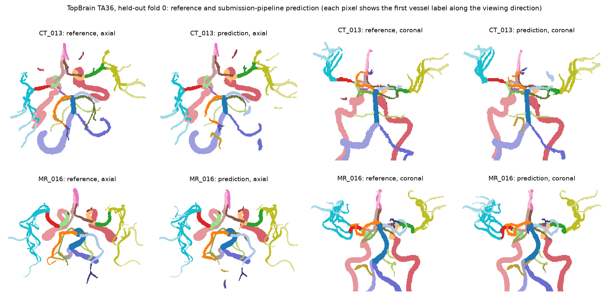

# TopBrain 2026 TA36: 36-class brain vessel segmentation

Segmentation of 36 brain vessel classes in CTA and MRA for the TA36 track of
[TopBrain 2026](https://topbrain2026.grand-challenge.org/). Left-right swap
test-time augmentation and connectivity-based post-processing raise
class-averaged Dice from 0.699 to 0.721 on a held-out fold and cut
invalid-neighbour errors fivefold, and the full pipeline is packaged as a Grand
Challenge container. An error analysis under the official metrics shows that
vessels of variable presence, predicted but absent from the reference, dominate
the remaining HD95 error. The underlying model is the organisers' (UZH) nnU-Net
baseline, trained with their own fork and settings from their released Docker
image. This repository adds the work around it: a reimplementation of the
baseline's training-set construction (cross-modal registration with a quality
check, label-swapped mirroring), a memory-reduced rewrite of one loss term so
training fits on a 16 GB GPU, left-right swap TTA, fragment removal and
confidence-based class dropping, the error analysis, and the submission
container.



Two held-out scans close to the fold's median score (class-averaged Dice 0.706
for CT 013 and 0.709 for MR 016), reference against the submission pipeline's
prediction. Each pixel shows the first labelled vessel along the viewing
direction (`scripts/figure_mip.py`).

## Data and setup

- 25 patients with one CTA and one MRA each (50 scans), TA36 labels
  (Zenodo 21972006, `labelsTr_topbrain_v2_topaneu36class`).
- Five patient-level folds (seed 12345). All numbers below are fold 0:
  5 patients, 10 scans (5 CTA, 5 MRA), scored with the official
  [TopBrain metrics](https://github.com/CoWBenchmark/TopBrain_Eval_Metrics).
- Training data as in the baseline (`Dataset102`): originals, cross-modal
  rigidly registered copies (CTA on the MRA grid and vice versa, landmark
  initialisation plus mask-based refinement, 23/25 pairs pass a 1 mm overlap
  check) and left-right mirrored copies with every R-/L- label swapped. The
  networks train without mirroring augmentation, which would otherwise flip
  lateralised labels.
- Single RTX 5070 Ti (16 GB). One loss term of the fork (`DiffLoss`) is
  rewritten to fit in memory with identical values and gradients
  (`patches/uzh_fork_0001_diffloss_memory.patch`).

Differences from the organisers' run: 192 instead of 300 training cases, fold 0
instead of their fold 4, 200 or 500 instead of 1000 epochs, and single models
instead of their three-model ensemble.

## Results (fold 0, 10 scans)

Class-averaged scores; all rows use the organisers' per-label removal of
components of 10 voxels or fewer. With 10 scans, differences of about 0.01 Dice
are within noise.

| Model | Epochs | Dice | clDice | B0 err | HD95 | Nb err | Side-road F1 |
|---|---|---|---|---|---|---|---|
| UZH ResEnc-M (baseline) | 200 | 0.689 | 0.761 | 0.99 | 30.8 | 0.018 | 0.667 |
| UZH ResEnc-M, fine-tuned (lr 1e-3) | 200 + 100 | 0.682 | 0.761 | 0.98 | 33.2 | 0.042 | 0.672 |
| same, focal loss instead of weighted CE | 200 + 100 | 0.679 | 0.755 | 0.94 | 35.5 | 0.036 | 0.664 |
| UZH ResEnc-M, continued | 500 | 0.699 | 0.765 | 0.93 | 35.7 | 0.036 | 0.683 |
| UZH plain_conv | 200 | 0.641 | 0.704 | 1.71 | 49.8 | 0.134 | 0.620 |
| stock nnU-Net ResEnc-M, Dice + focal | 200 | 0.693 | 0.763 | 0.81 | 33.5 | 0.030 | 0.681 |

Inference additions on the 500-epoch model:

| Inference | Dice | clDice | B0 err | HD95 | Nb err | Side-road F1 |
|---|---|---|---|---|---|---|
| single pass | 0.699 | 0.765 | 0.93 | 35.7 | 0.036 | 0.683 |
| + left-right swap TTA | 0.709 | 0.772 | 0.80 | 33.1 | 0.013 | 0.686 |
| + fragment removal (< 10 mm³) | 0.710 | 0.779 | 0.50 | 34.4 | 0.024 | 0.692 |
| + both (submission pipeline) | 0.721 | 0.787 | 0.45 | 30.3 | 0.007 | 0.703 |

- Longer training keeps lowering the training loss but barely moves the
  held-out scores; with 20 training patients per fold, data rather than epochs
  looks like the limit.
- About three classes per case are predicted but absent from the reference,
  mostly vessels whose presence varies between people (Pcom, AChA, PICA/AICA,
  3rd A2/A3). The metrics average over the union of predicted and reference
  classes, so each counts like a missed vessel. With the submission pipeline
  they account for 74% of the summed HD95; the one scan without false or
  missed classes has an HD95 of 2.4.
  Dropping low-confidence classes (`scripts/postprocess.py --drop-conf`)
  helps on this fold, but its threshold was tuned on the same scans, so it is
  off by default.

## Layout

```text
scripts/
  prepare_nnunet_dataset.py   Dataset101: originals, patient-level folds
  register_pairs.py           cross-modal rigid registration with QC
  build_augmented_dataset.py  Dataset102: + registered and L-R swapped copies
  train_uzh_resencm.sh        UZH fork, their settings (ARCH=resencm|plainconv)
  train.sh                    stock nnU-Net runs
  predict_tta.py              inference with left-right swap TTA
  postprocess.py              fragment removal, confidence-based class dropping
  evaluate.py                 official TopBrain metrics (12 leaderboard scores)
  figure_mip.py               label projections of reference and prediction
  extract_image_src.py        fork source from the organisers' Docker image
  jobs/                       small job queue for the GPU host (systemd)
topbrain_trainers.py          stock nnU-Net trainer variants (Dice + focal)
uzh_trainers.py               UZH-fork trainer variant (focal instead of CE)
patches/                      memory patch for the fork's DiffLoss
submission/                   Grand Challenge container (TA36 interface)
```

## Running

Code lives on a workstation and is mirrored to a GPU host with
`scripts/sync.sh`; data, environments and results stay on the host.

```bash
uv sync && source scripts/env.sh
python scripts/prepare_nnunet_dataset.py
python scripts/register_pairs.py && python scripts/build_augmented_dataset.py
# UZH fork: extract from their image, apply patches/, install into .venv-uzh
EPOCHS=200 scripts/train_uzh_resencm.sh 0
python scripts/predict_tta.py MODEL_DIR IMAGES_DIR OUT_DIR --tta lr
python scripts/postprocess.py OUT_DIR PP_DIR --min-tree-mm3 10
python scripts/evaluate.py PP_DIR SCORES_DIR    # with the metrics repo's env
```

`scripts/jobs/submit.sh NAME` queues a job on the GPU host; `status.sh` shows
progress and results.

## Submission container

`submission/` follows the organisers'
[template](https://github.com/CoWBenchmark/TopBrain_Algo_Submission);
`main.py` and `torch_utilities.py` are theirs, unchanged. `inference.py`
reorients to LPS, runs the fork with left-right swap TTA, removes small
components and fragments, and restores the input geometry. Weights and a
`config.json` (TTA, thresholds) are uploaded separately as the model tarball,
so changing them needs no rebuild. `prepare.sh` assembles the build context and
tarball; `test_local.py` runs the template without Docker. Base image
`pytorch/pytorch:2.13.0-cuda12.6-cudnn9-runtime` (T4, CUDA 12.6).

## Licence

Apache-2.0, as nnU-Net. `submission/main.py` and `submission/torch_utilities.py`
come from the organisers' template.
